# Student Library Portal

React 19 + Vite + Tailwind 4 frontend with an Express server (optional Gemini-powered reading recommendations).

## Features
Catalog search, barcode scan check-in/out, reservations, fines & payments, reading streaks/timer, AI advisor, admin dashboard.
Mobile-first (safe-area aware bottom nav), installable PWA, state persisted in `localStorage`.

## Run
```bash
npm install
cp .env.example .env   # add GEMINI_API_KEY (optional; falls back to catalog matching)
npm run dev            # http://localhost:3000  (PORT env supported)
```

## Production
```bash
npm run build && npm start
```

## Scripts
`npm run lint` (type-check) · `npm test` (unit tests)

## Mobile screenshots (390×844)
| Home | Search | AI Advisor | Borrowed |
|---|---|---|---|
| 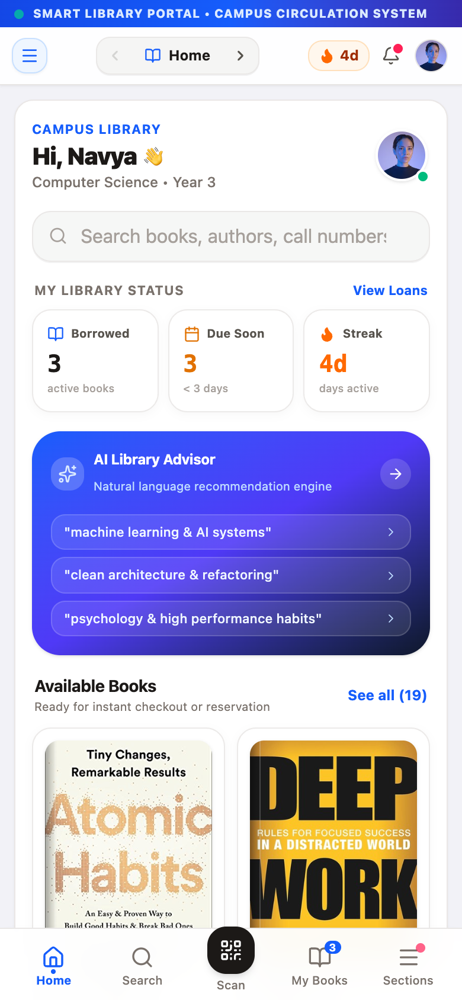 | 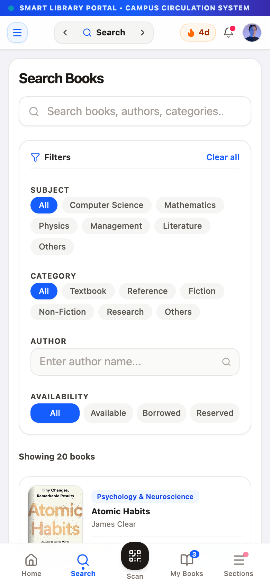 | 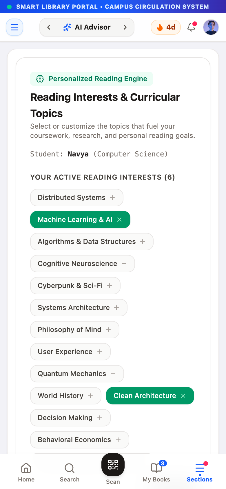 | 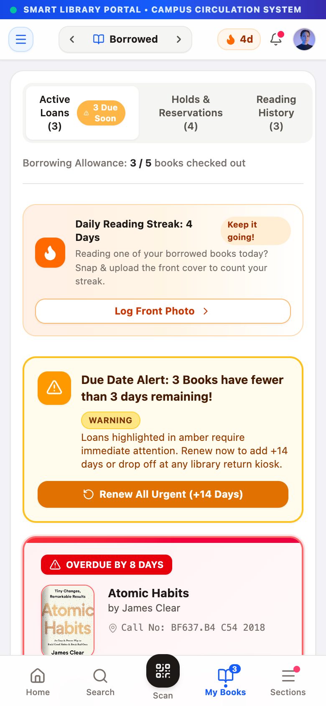 |

| Holds | Streak | Fines | Scan |
|---|---|---|---|
| 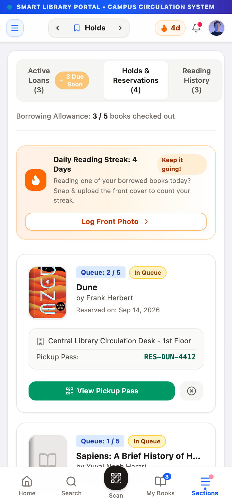 | 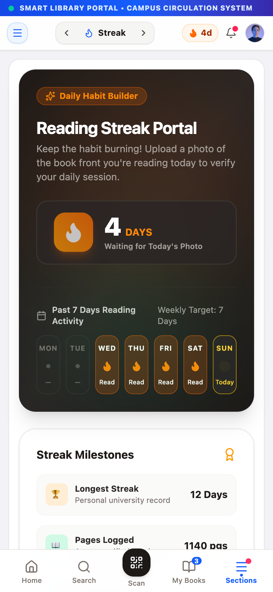 | 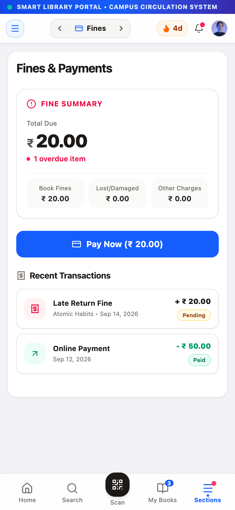 | 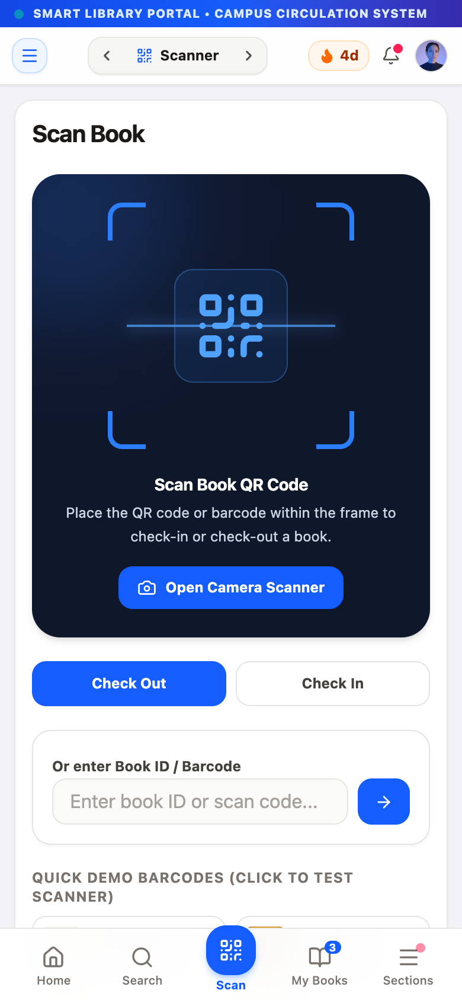 |

| Alerts | Profile | Admin | Menu |
|---|---|---|---|
| 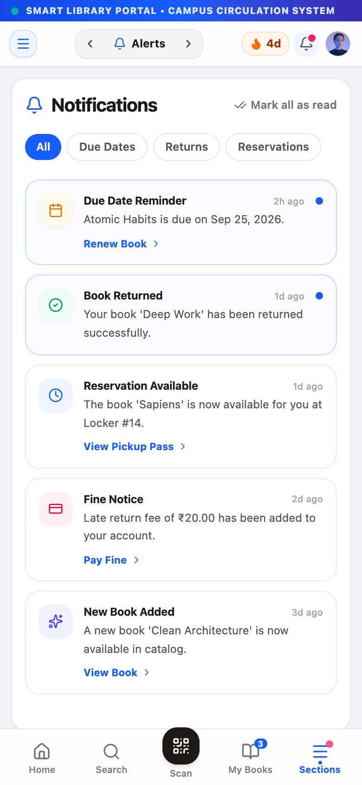 | 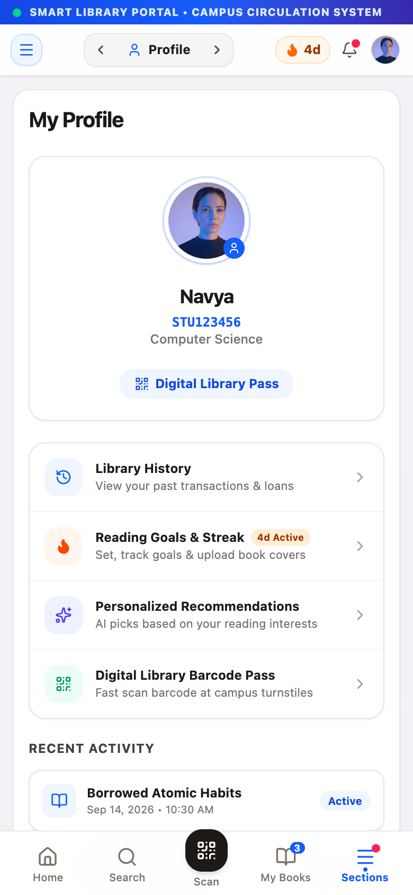 | 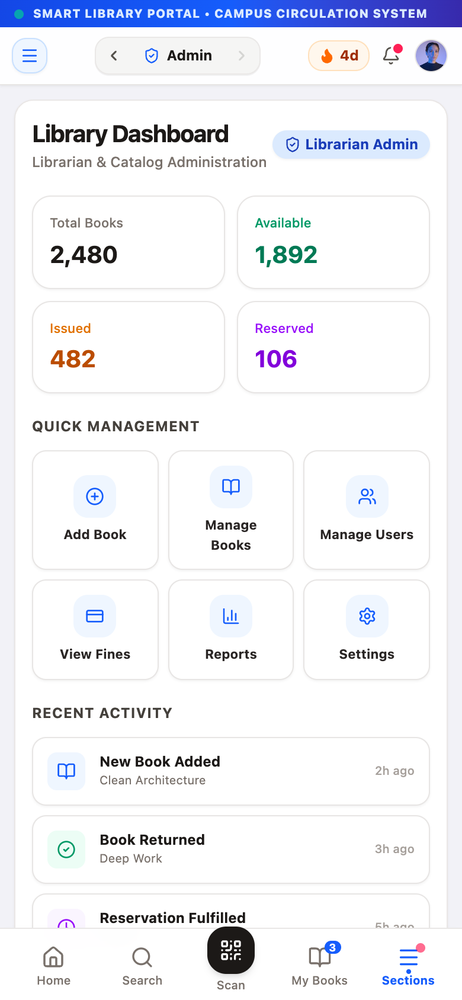 | 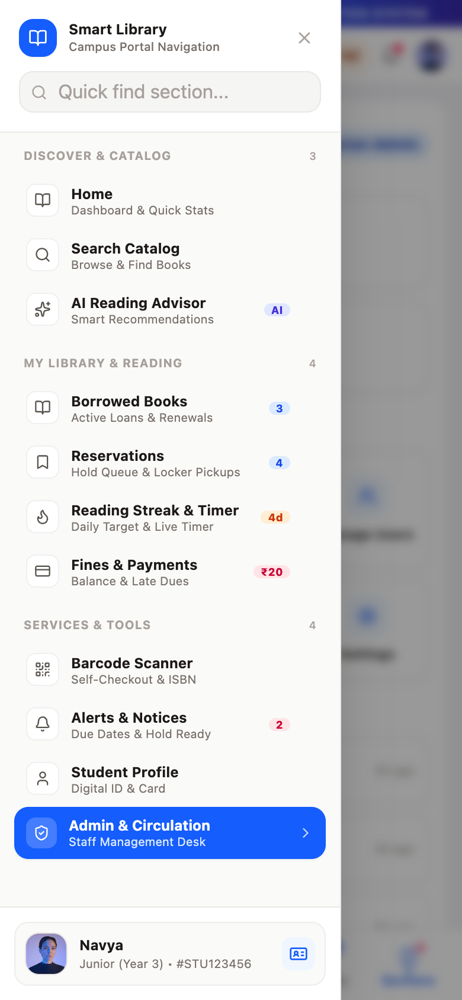 |

| Book detail | Camera scanner |
|---|---|
| 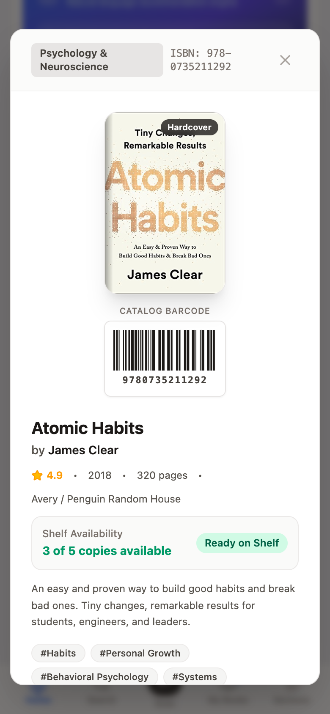 | 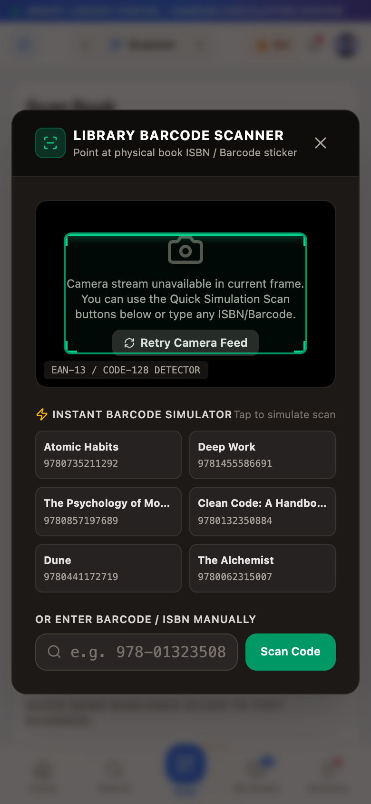 |
